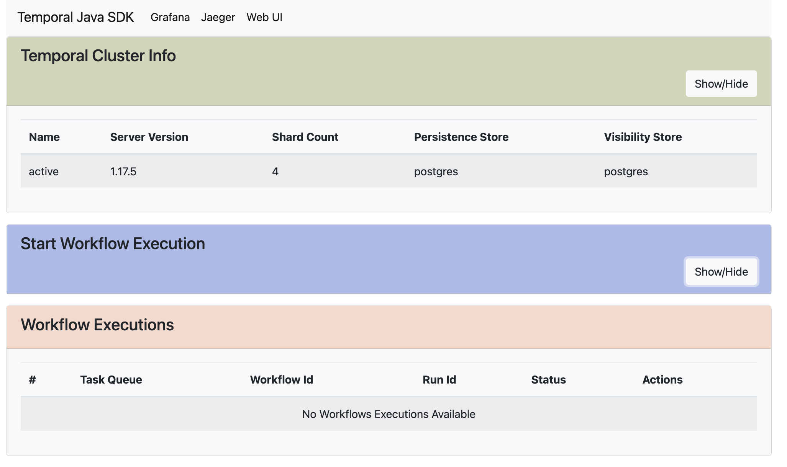
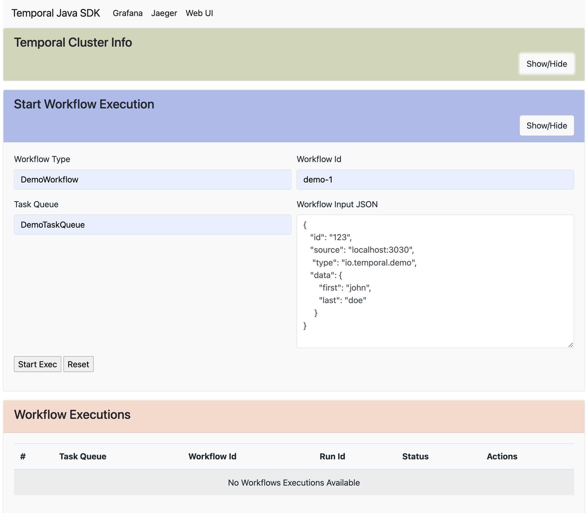
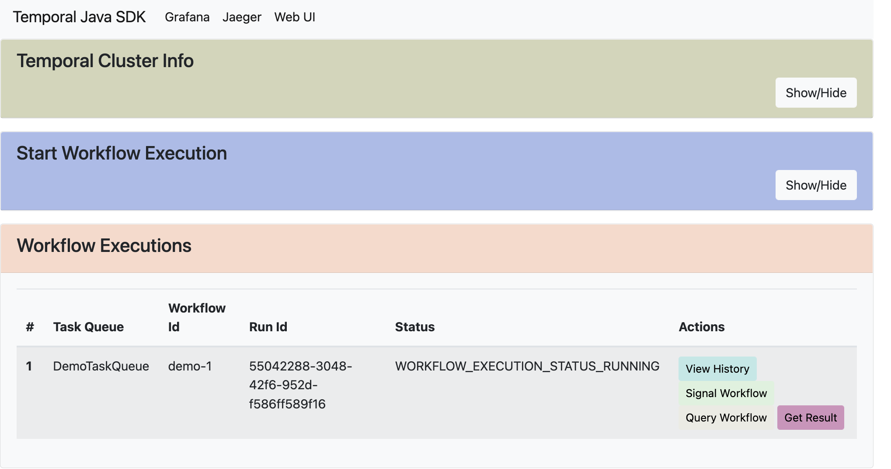
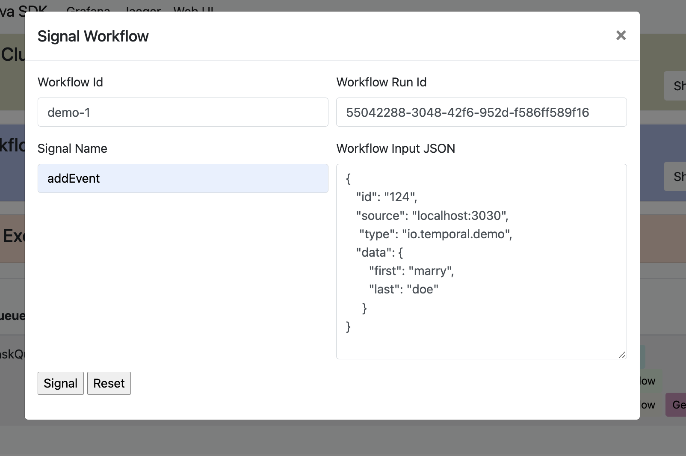
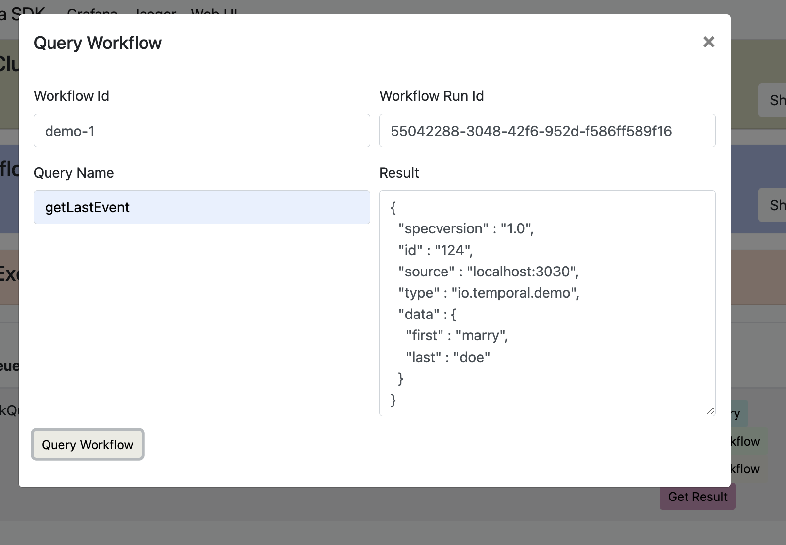
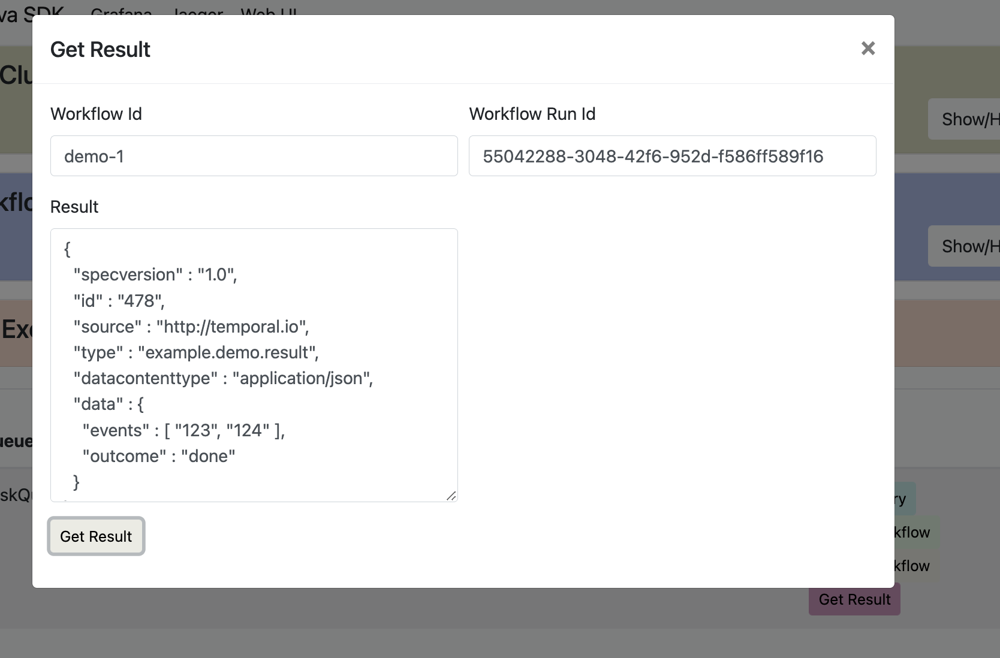

# Temporal Spring Boot Integration Demo

## Links

* [Temporal Java SDK](https://github.com/temporalio/sdk-java)
* [Spring Boot Integration package](https://github.com/temporalio/sdk-java/tree/master/temporal-spring-boot-autoconfigure-alpha)

## Intro

This demo showcases Temporal Java SDK integration with Spring Boot.
It uses the [Java SDK Spring Boot AutoConfig](https://github.com/temporalio/sdk-java/tree/master/temporal-spring-boot-autoconfigure-alpha).

Shown features:
* [Connection Setup](https://github.com/temporalio/sdk-java/tree/master/temporal-spring-boot-autoconfigure-alpha#connection-setup)
* [Workflows and Activities auto-discovery](https://github.com/temporalio/sdk-java/tree/master/temporal-spring-boot-autoconfigure-alpha#auto-discovery)
* [Data converter auto-discovery](https://github.com/temporalio/sdk-java/tree/master/temporal-spring-boot-autoconfigure-alpha#data-converter)
* [Integration with Metrics (Prometheus)](https://github.com/temporalio/sdk-java/tree/master/temporal-spring-boot-autoconfigure-alpha#metrics)
* [Integration with Tracing (Jaeger)](https://github.com/temporalio/sdk-java/tree/master/temporal-spring-boot-autoconfigure-alpha#tracing)
* [Testing](https://github.com/temporalio/sdk-java/tree/master/temporal-spring-boot-autoconfigure-alpha#testing)
* (todo) [mTLS](https://github.com/temporalio/sdk-java/tree/master/temporal-spring-boot-autoconfigure-alpha#mtls)

## Run Demo

1. First we need to set up Temporal Server. To showcase the metrics
and tracing capabilities it's easiest to use [this](https://github.com/tsurdilo/my-temporal-dockercompose) repo
which has it all built in and ready to go. If you already have Temporal
server running on Docker locally you can clean and prune and then run:

```
git clone https://github.com/tsurdilo/my-temporal-dockercompose
cd my-temporal-dockercompose
docker network create temporal-network
docker compose -f docker-compose-postgres.yml -f docker-compose-services.yml up
```

2. This demo depends on the [Temporal Spring Boot Thymeleaf UI](https://github.com/tsurdilo/temporal-springboot-web-ui)
project for the web part of it.
So first we have to fetch and compile it:

```
git clone git@github.com:tsurdilo/temporal-springboot-web-ui.git
cd temporal-springboot-web-ui
mvn clean install
```
   
3. Now lets build and start the demo

```
git clone git@github.com:tsurdilo/temporal-springboot-demo.git
cd temporal-springboot-demo
mvn clean install spring-boot:run
```

## Use Demo

Once your demo has started up you can access the ui via
[localhost:3030](http://localhost:3030/)

<p align="center">

</p>

### Start new Execution

Click on "Show/Hide" in the "Start Workflow Execution" module
to expand it. This will let us start a new workflow exec.

<p align="center">

</p>

Our workflow type is "DemoWorkflow" and its running as we specified via annotations 
on the "DemoTaskQueue" task queue. You can set whichever workflow id you wish.
The input of our workflow execution must be in CloudEvents format as 
that is what our custom data converter expects. 
Here is sample that you can use:

```json
{
  "id": "123",
  "source": "localhost:3030",
  "type": "io.temporal.demo",
  "data": {
   "first": "john",
   "last": "doe"
  }
}
```

Click on "Start Exec" to start a new workflow execution:

<p align="center">

</p>

### Signal Execution
Our execution is in "Running" status, as it is waiting on the next 
CloudEvent sent to it to continue. It is going to wait until we do that, 
so let's send it. 
Click on the "Signal Workflow" button in the "Actions" column:

Fill in "addEvent" as the signal name, as that is what our demo workflow defines
as the signal method. Enter in a different CloudEvent in the signal payload, you can use:

```json
 {
   "id": "124",
   "source": "localhost:3030",
   "type": "io.temporal.demo",
   "data": {
     "first": "marry",
     "last": "doe"
   }
 }
 ```

<p align="center">

</p>

And click the "Signal" button.

You should see that our workflow execution is now in the "Completed" status.

### Query Execution

With Temporal you can query completed workflow executions (up to the 
configured retention period on the namespace). So let's try to query it.
The query will give us the last event sent to the workflow, so we should
get the same event as what we just signalled.

For this click on the "Query Workflow" button in "Actions",
set the query name to "getLastEvent" as that is what our workflow definition 
defines as the query name, then click "Query Workflow" button:

<p align="center">

</p>

### Get Execution Result

Next lets see what our workflow execution results are. Again you can get results 
of completed executions up to configured retention period on the namespace.

For this click on the "Get Result" button in "Actions", then click on "Get Result" button.
You should see the results which is also a CloudEvent that includes all the ids of the so far 
sent signals. For our demo that should be "123" and "124", the ids of the event
that we sent as workflow data input and then the one that we signalled the workflow execution earlier:

<p align="center">

</p>

### See Metrics and Tracing Info

For metrics, in the navbar on top of the page click on "Grafana" and 
browse the SDK and Server dashboards that come out of the box for you.


For tracing, in the navbar on top of the page click on "Jaeger".
For service select "temporal-demo", and then in the Operation dropdown
select "RunWorkflow:DemoWorkflow", then click "Find Traces".

In the result select the http post trace which is the one the UI used
to start our workflow execution:

<p align="center">

</p>


